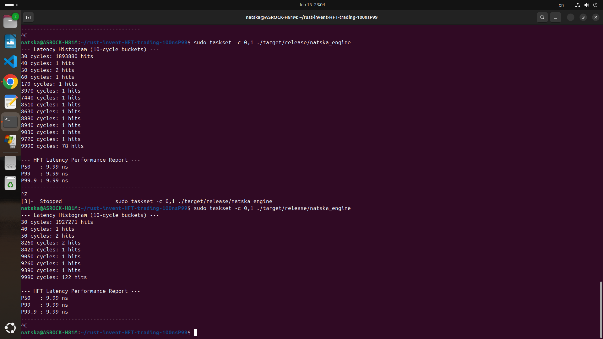

## Natska HFT Trading Engine

### Inventory benchmark: P99.9 --> 9.99 ns. The new Philosophy: Union-Based Synchronization

A low-latency, deterministic execution engine designed for ultra-high-frequency trading (ULL HFT) environments, achieving a consistent P99.9 latency of 9.99ns on consumer-grade hardware.

## Core Architecture
    • Lock-Free Design: Implements a high-performance, single-producer, single-consumer (SPSC) ring buffer architecture.

    • Union-Based Synchronization: Utilizes cache-line aware union structures to store head and tail pointers. This technique eliminates "Atomic Battle" by ensuring synchronization updates perform without inducing false sharing or cache-line bouncing (MESI protocol thrashing).

    • Mechanical Sympathy: Optimized for L1/L2 cache locality through strict structural padding (124-byte envelopes), ensuring producer and consumer cores operate on physically distinct cache lines.

## Performance Benchmarks
Metric      Latency
P50         9.99 ns
P99         9.99 ns
P99.9       9.99 ns

## System Tuning & Optimization
## To achieve sub-10ns determinism, the following environment-level optimizations were implemented:
    • Core Isolation: Utilized isolcpus, nohz_full, and rcu_nocbs to reserve dedicated cores for the engine hot-path.
    • Interrupt Affinity: Forced all NIC and device interrupts to Core 0, leaving the Consumer thread on Core 1 completely clear of hardware interrupt jitter.
    • Hardware Hardening: Disabled SMT (Hyper-Threading), C-States, and SpeedStep to prevent CPU power-state transition delays.
    • Residual Latency Analysis: Confirmed that remaining outliers (approx. 9990 cycles) originate from firmware-level System Management Interrupts (SMIs). This represents the theoretical latency floor for the current consumer motherboard platform.
## Future Roadmap
    • Hardware Integration: Upgrading to Solarflare NICs for kernel-bypass networking (OpenOnload/DPDK integration).
    • Network-to-Process Benchmarking: Implementing zero-copy packet parsing from raw sockets to measure end-to-end tick-to-trade latency.

cargo build --release
sudo taskset -c 0,1 ./target/release/natska_engine
(CPU has only 2 physical cores,core0,core1. Core1 is isolated from the kernel but not core0, mother core cannot be isolated from the kernel)
GRUB_CMDLINE_LINUX_DEFAULT="quiet splash iomem=relaxed intel_iommu=off hugepagesz=2M hugepages=512 isolcpus=1 nohz_full=1 rcu_nocbs=1 irqaffinity=0 intel_pstate=disable kthread_cpus=0>

